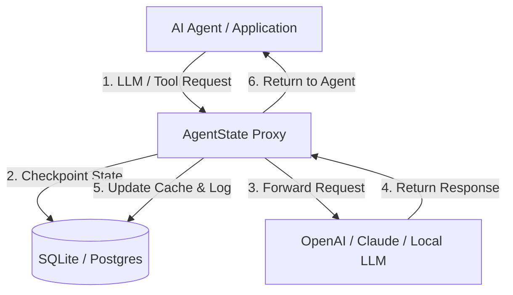

# 🛡️ AgentState
### The Open-Source Resilience & Debugging Proxy for Autonomous AI Agents

> **Problem:** When an AI agent crashes on step 87 out of 100, you lose the entire execution history, waste thousands of tokens, and leave the user with a broken experience.
>
> **Solution:** AgentState is a lightweight, self-hosted proxy that intercepts your agent's LLM and tool calls, automatically checkpoints their execution state, handles retries, and lets you pause, edit, and resume runs from any point.

---

## 🚀 Key Features

* **🔌 Plug-and-Play Integration:** No SDKs or code changes required. Just swap your LLM provider's `baseURL` to point to AgentState.
* **💾 Automatic Checkpointing:** Every prompt, response, and tool invocation is saved to a local SQLite/Postgres database.
* **🔁 Fail-Safe Retries:** Automatic exponential backoff for failed tool executions and rate-limited LLM API calls.
* **🎛️ Session Replay & Rollback:** Visual dashboard to inspect agent trajectories. If a step fails, fix the code/prompt and resume the run exactly where it left off.
* **✋ Human-in-the-Loop Gateway:** Intercept sensitive tool calls (e.g., executing shell commands, processing payments) and pause execution until approved via webhook or dashboard.

---

## 📦 How It Works

Simply change your LLM client's endpoint to route requests through the AgentState proxy.

### Node.js (OpenAI SDK)
```javascript
import OpenAI from "openai";

const openai = new OpenAI({
  apiKey: process.env.OPENAI_API_KEY,
  // Point to your local AgentState proxy
  baseURL: "http://localhost:8080/v1", 
  defaultHeaders: {
    // Pass session ID to track the agent run state
    "x-agent-session-id": "session_user_9812", 
  }
});
```

### Python (OpenAI SDK)
```python
from openai import OpenAI

client = OpenAI(
    api_key="your-api-key",
    base_url="http://localhost:8080/v1",
    default_headers={
        "x-agent-session-id": "session_user_9812"
    }
)
```

---

## 🛠️ Architecture



---

## 🗺️ MVP Roadmap

### Phase 1: Local Proxy & State Store (Completed in MVP)
* Run a local proxy server that intercepts standard OpenAI-compatible endpoints (`/v1/chat/completions`).
* Auto-save all payloads, metadata, and responses to a local SQLite database.
* Provide CLI logs showing cost, latency, and trajectory for each session ID.

### Phase 2: Web Dashboard & Session Replay
* A beautiful local UI (Next.js/Tailwind) to view active and completed agent sessions.
* Interactive execution tree visualizer.
* Replay buttons to retry failed sessions from specific nodes.

### Phase 3: Collaborative Gatekeeper (Enterprise)
* Setup webhook triggers for "Requires Approval" tools.
* Slack/Discord integrations to approve or reject actions.
* Multi-tenant security policies, API key rotating, and encrypted audit vaults.

---

## 📄 License
AgentState is open-source software licensed under the [MIT License](LICENSE).
