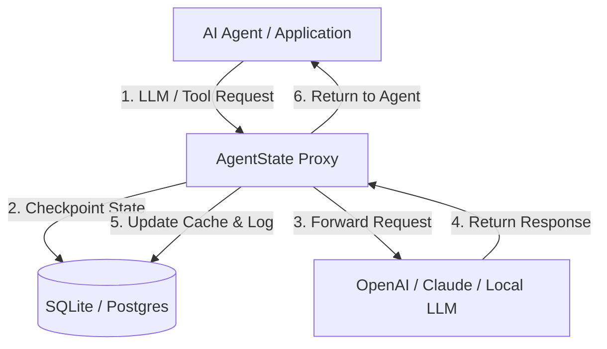

# 🛡️ AgentState
### The Open-Source Resilience & Debugging Proxy for Autonomous AI Agents

[](https://opensource.org/licenses/MIT)
[](https://www.python.org/)
[](https://fastapi.tiangolo.com/)

> **Problem:** When an AI agent crashes on step 87 out of 100, you lose the entire execution history, waste thousands of tokens, and leave the user with a broken experience.
>
> **Solution:** AgentState is a lightweight, self-hosted proxy that intercepts your agent's LLM and tool calls, automatically checkpoints their execution state, handles retries, and lets you pause, edit, and resume runs from any point.

---

## 🚀 Key Features

* **🔌 Plug-and-Play Integration:** No SDKs or code changes required. Just swap your LLM provider's `baseURL` to point to AgentState.
* **💾 Automatic Checkpointing:** Every prompt, response, and tool invocation is saved to a local SQLite database.
* **🔁 Fail-Safe Retries:** Automatic exponential backoff for failed tool executions and rate-limited LLM API calls.
* **🎛️ Session Replay & Rollback:** Visual dashboard to inspect agent trajectories. If a step fails, fix the code/prompt and resume the run exactly where it left off.
* **✋ Human-in-the-Loop Gateway:** Intercept sensitive tool calls (e.g., executing shell commands, processing payments) and pause execution until approved via webhook or dashboard.
* **🔌 Offline Mock Mode:** Run simulations completely offline with zero API costs using the built-in mock responder.

---

## 📦 How It Works

Simply change your LLM client's endpoint to route requests through the AgentState proxy.

### Node.js (OpenAI SDK)
```javascript
import OpenAI from "openai";

const openai = new OpenAI({
  apiKey: process.env.OPENAI_API_KEY || "mock-key",
  // Point to your local AgentState proxy
  baseURL: "http://localhost:8080/v1", 
  defaultHeaders: {
    // Pass session ID and step numbers to track agent state
    "x-agent-session-id": "session_user_9812", 
    "x-agent-step-number": "0"
  }
});
```

### Python (OpenAI SDK)
```python
from openai import OpenAI

client = OpenAI(
    api_key="mock-key",
    base_url="http://localhost:8080/v1",
    default_headers={
        "x-agent-session-id": "session_user_9812",
        "x-agent-step-number": "0"
    }
)
```

---

## 🛠️ Architecture



---

## 💻 Quick Start & Setup

### 1. Clone & Set Up Environment

```bash
# Clone the repository (once created)
git clone https://github.com/yourusername/agentstate.git
cd agentstate

# Create a virtual environment
python -m venv venv

# Activate virtual environment
# On Windows (PowerShell):
.\venv\Scripts\activate
# On macOS/Linux:
source venv/bin/activate

# Install dependencies
pip install fastapi uvicorn httpx openai
```

### 2. Start the Proxy Server
```bash
python server.py
```
* The proxy will start listening on `http://localhost:8080`.
* The embedded dashboard will be live at `http://localhost:8080/dashboard`.

### 3. Run the Agent Simulator
To see AgentState in action, run the simulated agent:
```bash
python test_agent.py
```
* **First Run:** The agent will execute Step 0 (Fetch customer) and Step 1 (Generate report) successfully, then simulate a crash on Step 2 (Send email).
* **Second Run:** Run `python test_agent.py` again. Steps 0 and 1 will be returned from the local SQLite cache instantly (**~15ms, $0.00 token cost**), and Step 2 will be retried and complete successfully.

---

## 🔌 API Reference

### Proxy Endpoint
* **`POST /v1/chat/completions`**: OpenAI-compatible endpoint. Expects standard OpenAI body.
  * **Headers:**
    * `x-agent-session-id` (Required for caching): Unique session ID tracking the agent run.
    * `x-agent-step-number` (Recommended): Step index of the execution loop (e.g. `0`, `1`, `2`).

### Management API (Used by Dashboard)
* **`GET /api/sessions`**: Retrieve list of all logged sessions.
* **`GET /api/sessions/{session_id}`**: Retrieve session metadata and step list.
* **`POST /api/sessions/{session_id}/reset`**: Rollback a session.
  * **Body:** `{"step_number": int}`
  * **Description:** Deletes all cached steps starting from the specified index and marks the session status as `RUNNING`.
* **`POST /api/sessions/{session_id}/status`**: Update session status.
  * **Body:** `{"status": "RUNNING" | "COMPLETED" | "FAILED"}`

---

## 📤 Push to Your GitHub

Since this is a fresh local repository, follow these steps to upload it to your GitHub profile:

1. Go to [github.com/new](https://github.com/new) and create a new repository named `agentstate` (do not initialize with README, license, or `.gitignore`).
2. Run the following commands in your terminal:
   ```bash
   # Add your remote GitHub URL
   git remote add origin https://github.com/YOUR_USERNAME/agentstate.git

   # Rename default branch to main
   git branch -M main

   # Push code to GitHub
   git push -u origin main
   ```

---

## 🗺️ Long-Term Roadmap

* **Phase 2:** Visual dashboard node graph representation (replacing list view).
* **Phase 3:** Open-core multi-tenant authentication (OAuth2 / API keys).
* **Phase 4:** Out-of-the-box integrations for LangGraph, Autogen, and CrewAI frameworks.

---

## 📄 License
AgentState is open-source software licensed under the [MIT License](LICENSE).
