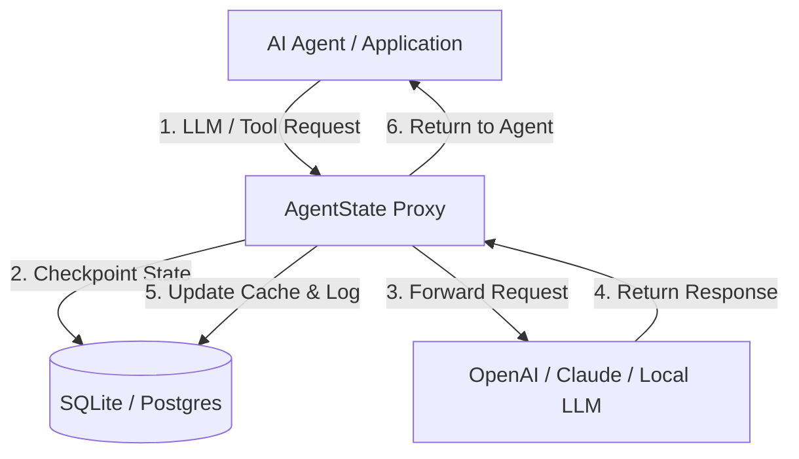

# 🛡️ AgentState
### The Open-Source Resilience & Debugging Proxy for Autonomous AI Agents

[](https://opensource.org/licenses/MIT)
[](https://www.python.org/)
[](https://fastapi.tiangolo.com/)

**Stop wasting tokens when AI agents crash.** When an agent fails on step 87 out of 100, you typically lose the entire execution history and have to restart. 

**AgentState** is a lightweight, self-hosted proxy that intercepts your LLM and tool calls, automatically checkpoints their state, and lets you pause, edit, and resume runs from any point—saving you money and time.


---

## ⚡ The 10-Second Setup

### 1-Line Python Integration (Recommended)
```python
from agentstate import AgentStateOpenAI

# Automatically routes all completions through AgentState proxy!
client = AgentStateOpenAI(session_id="session_user_9812", step_number=0)

response = client.chat.completions.create(
    model="gpt-4o",
    messages=[{"role": "user", "content": "Hello AgentState!"}]
)
```

### Standard OpenAI Client Setup (Python / Node.js)
No SDKs required. Just change your LLM client's `baseURL` to point to the AgentState proxy:

```python
from openai import OpenAI

client = OpenAI(
    api_key="your-api-key",
    base_url="http://localhost:8080/v1", # <-- Route through AgentState
    default_headers={"x-agent-session-id": "session_user_9812", "x-agent-step-number": "0"}
)
```

---

## 🚀 Key Features

* **🔌 1-Line Plug-and-Play Integration:** Use our native `AgentStateOpenAI` wrapper or simply swap your LLM provider's `baseURL` to point to AgentState. Works seamlessly with OpenAI, LangChain, and CrewAI.
* **💾 Automatic Checkpointing:** Every prompt, response, and tool invocation is saved to a local SQLite database.
* **🔀 Multi-Model Fallback:** Transparently reroutes requests to fallback models (e.g. `gpt-3.5-turbo`, Claude, Ollama) if the primary provider hits rate limits (429) or server errors (500).
* **✋ Human-in-the-Loop Gateway:** Intercept sensitive tool calls (e.g. executing shell commands, processing payments) and pause execution until approved via dashboard or API.
* **📥 Fine-Tuning Dataset Exporter:** Export production agent trajectories as OpenAI-compatible `.jsonl` fine-tuning datasets in a single click.
* **🔔 Webhook Alerts:** Receive real-time Slack/Discord webhooks when agent runs fail or require human approval.
* **🎛️ Session Replay & Rollback:** Visual dashboard to inspect agent trajectories. If a step fails, fix the code/prompt and resume the run exactly where it left off.
* **🔌 Offline Mock Mode:** Run simulations completely offline with zero API costs using the built-in mock responder.

---

## 🛠️ Architecture



---

## 💻 Quick Start & Setup

### 1. Clone & Set Up Environment

```bash
# Clone the repository (once created)
git clone https://github.com/aleenz1102/AgentState.git
cd agentstate

# Create a virtual environment
python -m venv venv

# Activate virtual environment
# On Windows (PowerShell):
.\venv\Scripts\activate
# On macOS/Linux:
source venv/bin/activate

# Install dependencies
pip install fastapi uvicorn httpx openai
```

### 2. Start the Proxy Server
```bash
python server.py
```
* The proxy will start listening on `http://localhost:8080`.
* The embedded dashboard will be live at `http://localhost:8080/dashboard`.

### 3. Run the Agent Simulators
To see AgentState resilience in action:
```bash
python test_agent.py
```
* **First Run:** The agent will execute Step 0 (Fetch customer) and Step 1 (Generate report) successfully, then simulate a crash on Step 2 (Send email).
* **Second Run:** Run `python test_agent.py` again. Steps 0 and 1 will be returned from local cache instantly (**~15ms, $0.00 token cost**), and Step 2 completes cleanly.

To see the **Human-in-the-Loop Safety Gateway** in action:
```bash
python test_hitl_agent.py
```
* The terminal will pause on Step #1 attempting a sensitive `send_email` action.
* Open `http://localhost:8080/dashboard`, view the **Pending Approval Banner**, and click **Approve Action** (or **Reject Action**).
* The agent in your terminal will immediately resume and complete!

---

## 🔌 API Reference

### Proxy Endpoint
* **`POST /v1/chat/completions`**: OpenAI-compatible endpoint. Expects standard OpenAI body.
  * **Headers:**
    * `x-agent-session-id` (Required for caching): Unique session ID tracking the agent run.
    * `x-agent-step-number` (Recommended): Step index of the execution loop (e.g. `0`, `1`, `2`).
    * `x-agent-require-approval` (Optional): Set to `"true"` to trigger the HITL Safety Gateway.

### Management & Approval API (Used by Dashboard)
* **`GET /api/sessions`**: Retrieve list of all logged sessions.
* **`GET /api/sessions/{session_id}`**: Retrieve session metadata and step list.
* **`POST /api/sessions/{session_id}/reset`**: Rollback a session.
* **`GET /api/approvals/pending`**: List all actions currently waiting for human approval.
* **`POST /api/approvals/{id}/action`**: Approve or reject an action (`{"action": "APPROVED" | "REJECTED"}`).

---

## 🗺️ Long-Term Roadmap

* **Phase 2:** Visual dashboard node graph representation (replacing list view).
* **Phase 3:** Open-core multi-tenant authentication (OAuth2 / API keys).
* **Phase 4:** Out-of-the-box integrations for LangGraph, Autogen, and CrewAI frameworks.

---

## 📄 License
AgentState is open-source software licensed under the [MIT License](LICENSE).
