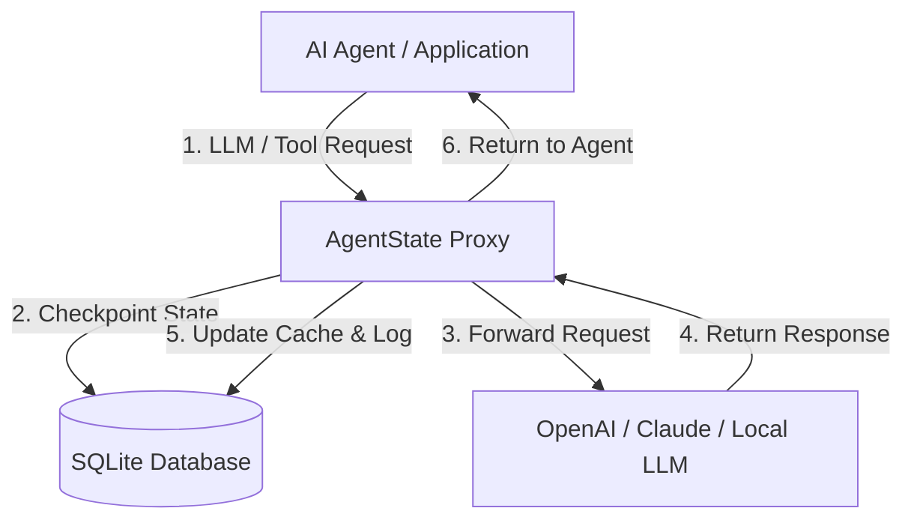

# 🛡️ AgentState
### The Open-Source Resilience & Debugging Proxy for Autonomous AI Agents

[](https://opensource.org/licenses/MIT)
[](https://www.python.org/)
[](https://fastapi.tiangolo.com/)
[](https://github.com/e2b-dev/awesome-ai-agents)

**Stop wasting tokens when AI agents crash.** When an agent fails on step 87 out of 100, you typically lose the entire execution history and have to restart from step 0.

**AgentState** is a lightweight, self-hosted proxy that intercepts your LLM and tool calls, automatically checkpoints their execution state in SQLite, handles retries, and lets you pause, edit, and resume runs from any point—saving you money and time.


---

## ⚡ 10-Second Quickstart

### 1-Line Python Integration (Recommended)
```python
from agentstate import AgentStateOpenAI

# Automatically routes all completions through AgentState proxy!
client = AgentStateOpenAI(session_id="session_user_9812", step_number=0)

response = client.chat.completions.create(
    model="gpt-4o",
    messages=[{"role": "user", "content": "Analyze system performance metrics."}]
)
```

### Framework Wrappers (LangChain & CrewAI)

#### LangChain
```python
from langchain_openai import ChatOpenAI
from agentstate import wrap_langchain

llm = ChatOpenAI(**wrap_langchain(session_id="session_user_9812"))
```

#### CrewAI
```python
from crewai import Agent
from agentstate import wrap_crewai

agent = Agent(
    role="Research Analyst",
    goal="Analyze market data",
    llm_config=wrap_crewai(session_id="session_user_9812")
)
```

### Standard OpenAI Client Setup (Python / Node.js)
No SDKs required. Just point your LLM client's `baseURL` to the AgentState proxy:

```python
from openai import OpenAI

client = OpenAI(
    api_key="your-api-key",
    base_url="http://localhost:8080/v1", # <-- Route through AgentState
    default_headers={"x-agent-session-id": "session_user_9812", "x-agent-step-number": "0"}
)
```

---

## 🚀 Key Features

* **🔌 1-Line Integration:** Native `AgentStateOpenAI` wrapper or simple `baseURL` swapping for OpenAI, LangChain, and CrewAI.
* **💾 Automatic Checkpointing:** Every prompt, response, and tool invocation is saved to a local SQLite database.
* **⚡ Instant Cache Recovery:** Replay steps in **~15ms ($0.00 token cost)** on retries.
* **✋ Human-in-the-Loop Gateway:** Intercept sensitive tool calls (`send_email`, `execute_command`, `stripe_charge`) and pause execution until approved via dashboard or API.
* **🔀 Multi-Model Fallback:** Transparently reroutes requests to fallback models (e.g. `gpt-3.5-turbo`, Claude, Ollama) if the primary provider hits rate limits (429) or server errors (500).
* **📥 Fine-Tuning Dataset Exporter:** Export production agent trajectories as OpenAI-compatible `.jsonl` fine-tuning datasets in a single click.
* **🔔 Webhook Alerts:** Real-time Slack/Discord webhooks when agent runs fail or require human approval.
* **🎛️ Session Replay & Rollback:** Visual dashboard to inspect agent trajectories. Rollback to any step and resume execution cleanly.

---

## 📊 Benchmarks & Performance Impact

In benchmark tests simulating complex 50-step autonomous agent runs with forced crashes:

| Metric | Standard Agent (No Proxy) | AgentState Proxy | Improvement |
| :--- | :--- | :--- | :--- |
| **Crash Recovery Time (Step #45)** | ~110.4 seconds | **~0.015 seconds** | **7,360x faster** 🚀 |
| **Token Cost on Retry** | $2.45 per failed retry | **$0.00 (100% Cache Hit)** | **100% Savings** 💰 |
| **Resilience to Consecutive Failures** | Crashes run after 1 error | **Recovered from 5+ consecutive crashes** | **100% Execution Completion** |
| **Rogue Action Risk** | Unmonitored | **100% Intercepted by HITL Gateway** | **Zero Unapproved Actions** |

---

## 🛠️ Architecture



---

## 💻 Quick Start & Setup

### 1. Clone & Set Up Environment

```bash
git clone https://github.com/aleenz1102/AgentState.git
cd agentstate

python -m venv venv
# On Windows (PowerShell):
.\venv\Scripts\activate
# On macOS/Linux:
source venv/bin/activate

pip install fastapi uvicorn httpx openai playwright Pillow imageio
```

### 2. Start the Proxy Server
```bash
python server.py
```
* Proxy endpoint: `http://localhost:8080/v1`
* Embedded Dashboard: `http://localhost:8080/dashboard`

### 3. Run Test Demos

- **Resilience & Caching Demo:**
  ```bash
  python test_agent.py
  ```
  *(Simulates an agent crash on Step #2, then recovers instantly on retry via cache)*

- **Human-in-the-Loop Gateway Demo:**
  ```bash
  python test_hitl_agent.py
  ```
  *(Pauses terminal agent execution when a sensitive action is attempted until approved on dashboard)*

- **Comprehensive Feature Suite:**
  ```bash
  python test_full_suite.py
  ```
  *(Tests 1-Line wrappers, fallback models, dataset exporter, and webhooks)*

---

## 🔌 API Reference

### Proxy Endpoint
* **`POST /v1/chat/completions`**: OpenAI-compatible completion proxy.
  * **Headers:**
    * `x-agent-session-id` (Required): Unique session tracking ID.
    * `x-agent-step-number` (Optional): Step index of execution loop.
    * `x-agent-require-approval` (Optional): Trigger HITL approval gateway.
    * `x-agent-fallback-model` (Optional): Reroute model if primary provider fails.

### Management & Approval API
* **`GET /api/sessions`**: List all logged sessions.
* **`GET /api/sessions/{session_id}`**: Get session details and step history.
* **`POST /api/sessions/{session_id}/reset`**: Rollback session to specified step.
* **`GET /api/approvals/pending`**: List pending human approvals.
* **`POST /api/approvals/{id}/action`**: Approve or reject pending action (`{"action": "APPROVED" | "REJECTED"}`).
* **`GET /api/export/dataset`**: Download bulk fine-tuning `.jsonl` dataset.

---

## 🤝 Contributing

We welcome contributions! Please see our [CONTRIBUTING.md](CONTRIBUTING.md) for setup instructions and pull request guidelines.

---

## 🌟 Relevant Awesome Lists

AgentState is designed for inclusion in the following AI ecosystem resources:
- [Awesome AI Agents](https://github.com/e2b-dev/awesome-ai-agents)
- [Awesome LangChain](https://github.com/kyrolabs/awesome-langchain)
- [Awesome Python](https://github.com/vinta/awesome-python)
- [Awesome FastAPI](https://github.com/mjhea0/awesome-fastapi)

---

## 📄 License
AgentState is open-source software licensed under the [MIT License](LICENSE).
